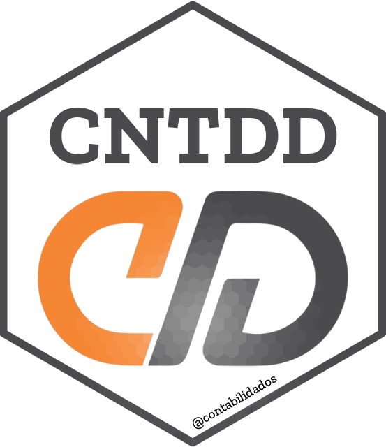

<!-- README.md is generated from README.Rmd. Please edit that file -->

```{r, include = FALSE}
knitr::opts_chunk$set(
  collapse = TRUE,
  comment = "#>"
)
```

# contabilidados.github.io

<!-- badges: start -->

<!-- badges: end -->

{width="154"}

------------------------------------------------------------------------

O projeto "contabiliDados" tem como finalidade monitorar e avaliar o desempenho e as operações tanto de entidades públicas quanto privadas no Brasil. Isso é realizado através da consolidação de dados que são normalmente divulgados de maneira fragmentada, fornecendo à sociedade indicadores condensados que refletem a gestão pública e corporativa. Adicionalmente, o projeto se dedica a manter repositórios de dados acessíveis, que servem tanto para pesquisas de interesse público quanto privado, incluindo a divulgação de índices de percepção e indicadores econômicos relevantes.

Neste contexto, o "contabiliDados" empreende na análise de dados tanto estruturados quanto não estruturados, provenientes das áreas de contabilidade e economia. Uma das suas principais contribuições é a incorporação de métodos eficazes para comunicar informações valiosas à sociedade. Isso é alcançado, em parte, através do uso de dashboards interativos, que transformam dados complexos em insights compreensíveis e acessíveis, promovendo uma maior transparência e entendimento sobre a gestão e desempenho econômico.

------------------------------------------------------------------------

Este site foi criado usando [Quarto](https://quarto.org/). Você pode encontrar mais informações sobre como criar um blog em Quarto na [documentação](https://quarto.org/docs/websites/website-blog.html).

O deploy foi feito em [Github pages](https://pages.github.com//), e os comentários em [giscus](https://giscus.app/).
